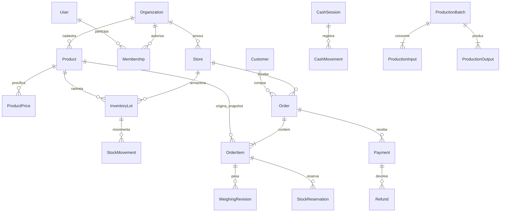

# Arquitetura operacional V1 — Açougue Organize

Data: 2026-09-10. Estado: decisão inicial para implementação; requisitos ainda não entregues são acompanhados no plano. O complemento SaaS prevalece sobre a ideia de adaptar um sistema de uma única loja posteriormente.

## 1. Visão do produto

Conectar compra, recebimento, estoque, transformação, catálogo, venda, separação, pesagem, pagamento, entrega e resultado. Atender primeiro o açougue piloto, com o mesmo provisionamento usado pelo segundo cliente. O produto é uma empresa SaaS desde a primeira migration.

## 2. Personas

| Persona | Trabalho principal | Acesso |
|---|---|---|
| Proprietário | Resultado, preços, pessoas e assinatura | Organização e lojas autorizadas |
| Gerente | Operação, descontos e conferência | Lojas atribuídas |
| Caixa | Venda rápida, recebimento e fechamento | Caixa e loja atribuídos |
| Açougueiro/separador | Preparação, embalagem e peso real | Filas e itens autorizados |
| Entregador | Rota e comprovação de entrega | Dados mínimos da entrega atribuída |
| Financeiro | Contas, recebimentos e conciliação | Permissões financeiras explícitas |
| Consumidor | Comprar, aprovar diferença e acompanhar | Pedido próprio por token seguro |
| Comprador B2B | Repetir pedido e acompanhar crédito | Empresa compradora vinculada |
| Equipe SaaS | Assinaturas, saúde e suporte | Identidade de plataforma separada |

## 3. Jornadas

**Primeira venda:** cadastro → organização → loja → configuração/importação → abertura de caixa → produto por peso/unidade → recebimento → conclusão → baixa de estoque e auditoria. A ativação requer produto, caixa e primeira venda concluída.

**Pedido online:** catálogo público da loja → carrinho estimado → entrega/retirada e consentimento de variação → reserva → separação → pesagem → aprovação quando necessária → pagamento final → entrega/retirada. Repetir checkout não cria outro pedido.

**Entrada e produção:** compra → conferência → lote → estoque → ordem de desossa → consumos e saídas reais → conferência de massa/custo → publicação dos lotes resultantes. Relatórios distinguem faturamento, recebimento e margem.

## 4. Bounded contexts

Identity autentica pessoas; Tenancy autoriza organização/lojas; Catalog define produtos; Pricing resolve preço; Orders coordena atendimento; Inventory registra disponibilidade e movimentos; POS/Cash registra venda física e dinheiro; Payments registra autorização/captura/devolução; Production transforma material; Purchasing recebe mercadoria; Financial acompanha obrigações e liquidações; Delivery organiza entrega; Integrations traduz provedores; Analytics lê projeções. Billing SaaS e Platform Administration têm fronteiras próprias, descritas na arquitetura SaaS.

Cada módulo escreve somente suas tabelas. Serviços de aplicação coordenam transações locais entre módulos quando a integridade exige. Eventos pós-commit alimentam notificações, integrações e projeções; não substituir transações de estoque/pagamento por eventos eventualmente consistentes.

## 5. Módulos e aplicações

Monorepo previsto: `apps/api`, `apps/worker`, `apps/store-web`, `apps/storefront-web`, `apps/admin-web`, `apps/device-bridge`; pacotes `domain`, `contracts`, `ui`, `tenancy`, `billing`, `integrations`, `observability`, `config`.

O PDV é uma superfície independente dentro de store-web, com cache offline próprio. Platform Admin usa autenticação/audience e rotas separadas. Storefront publica somente campos comerciais autorizados. O bridge é opcional e local. Não criar serviços vazios apenas para preencher diretórios; acrescentar cada executável na sua fatia.

## 6. Entidades centrais

Product distingue espécie, corte, matéria-prima, unidade de estoque e estratégia de venda. ProductVariant representa variação com estoque próprio; PreparationOption e PackagingOption representam preparo/embalagem sem duplicar SKU. Estratégias: WEIGHT_FREE, WEIGHT_INCREMENT, FIXED_PACKAGE, APPROXIMATE_UNIT, MINIMUM_WEIGHT, UNIT. KG/G convertem para gramas; UNIT/PACKAGE/BOX usam conversões versionadas e explícitas quando houver embalagem. Não inferir massa de unidade sem configuração.

Order contém itens, snapshots, revisões de pesagem, status e histórico. Customer e BusinessCustomer representam compradores. InventoryLot, StockMovement e StockReservation preservam rastreabilidade. CashSession, CashMovement, Payment, Refund e Settlement têm ciclos independentes. O modelo completo está em DATABASE_SCHEMA_V1.md.

## 7. Relacionamentos e propriedade

Organization contém Stores e Memberships. Produtos pertencem à organização; preço, estoque e venda pertencem à loja. Um item referencia produto e, quando aplicável, variante; preserva snapshot comercial mesmo se o produto for desativado. Loja e entidade relacionada usam chaves estrangeiras compostas com organization_id. ProductionOutput referencia o lote de produção e origina lote de estoque. SaleAllocation relaciona a venda aos lotes efetivamente consumidos.

## 8. ERD inicial

## 9. Máquinas de estado

Separar atendimento, pagamento e entrega para evitar um enum combinatório. `fulfillmentStatus`: RECEIVED → CONFIRMED → SEPARATING → WEIGHING → WEIGHT_ADJUSTED → READY → COMPLETED. WEIGHING pode ir a WAITING_CUSTOMER_APPROVAL; a aprovação referencia a revisão exata e retorna a WEIGHT_ADJUSTED. Nova pesagem invalida a aprovação anterior. READY exige itens resolvidos e valor aprovado. COMPLETED exige política de pagamento atendida e entrega/retirada concluída. Cancelamento anterior à conclusão libera reservas; posterior à venda usa processo de devolução, não reabre a venda.

`paymentStatus`: UNPAID → AUTHORIZED → PARTIALLY_PAID/PAID → PARTIALLY_REFUNDED/REFUNDED; FAILED registra tentativa, sem apagar pagamentos anteriores. Fluxo PAY_AFTER_WEIGHING pode ir de UNPAID a PAID. Captura não excede autorização, salvo operação adicional explícita. Devolução não excede capturado menos já devolvido.

`deliveryStatus`: NOT_REQUIRED, WAITING_PICKUP, SCHEDULED, READY, OUT_FOR_DELIVERY, DELIVERED, PICKED_UP, FAILED. Retirada não transita a OUT_FOR_DELIVERY. Caixa OPEN → CLOSED; reabertura exige justificativa/permissão. Produção DRAFT → IN_PROGRESS → REVIEW → COMPLETED; cancelamento só antes de efeitos definitivos ou mediante reversão rastreada.

Todas as transições usam versão esperada, guardas de negócio e histórico com ator, motivo, origem e timestamp UTC. Estado fornecido livremente por PATCH não é aceito.

## 10. Eventos de domínio

OrderCreated, OrderConfirmed, PickingStarted, ItemWeighed, WeightApprovalRequested, OrderWeightAdjusted, PaymentAuthorized, PaymentCaptured, PaymentRefunded, OrderReady, OrderDelivered, SaleCompleted, StockReserved, StockReleased, StockDeducted, PurchaseReceived, ProductionStarted, ProductionFinished, InventoryLossRecorded. Envelope: eventId, type, schemaVersion, organizationId, storeId, aggregateId, aggregateVersion, occurredAt, correlationId e payload mínimo. Consumidor mantém inbox idempotente por eventId; particionamento e ordenação por agregado.

## 11. Arquitetura técnica

Monólito modular NestJS/TypeScript e PostgreSQL no início. Next.js/React para web; biblioteca acessível de componentes e tokens compartilhados; PostgreSQL com SQL versionado e consultas parametrizadas, ORM/query builder escolhido após validar suporte a transações/RLS. Redis é cache e coordenação de tarefas, nunca fonte única de estoque. BullMQ processa outbox, importação, reconciliação e notificações; S3 guarda arquivos privados. SSE serve filas operacionais inicialmente; WebSocket só onde bidirecionalidade trouxer valor. Docker separa API/worker/web. Ambientes development, staging e production independentes.

## 12. Offline do PDV

IndexedDB guarda catálogo/preços versionados, carrinho, autorização offline limitada e operações pendentes por deviceId. Service worker disponibiliza shell. Cada venda recebe UUID local, sequência do dispositivo, versão de preço e chave idempotente persistida antes de mostrar sucesso. Sincronização envia lotes com resultado individual ACCEPTED/CONFLICT/REJECTED; só remove pendência após confirmação durável.

Modo offline aceita apenas métodos locais habilitados; não simula autorização de cartão/PIX nem emissão fiscal. Guardar recibo provisório explicitamente identificado. Preços têm validade de snapshot e descontos têm teto autorizado. Sessão offline tem expiração, permissões reduzidas e revogação aplicada na reconexão. Troca de usuário/tenant não reutiliza cache; pendências são preservadas protegidas até resolução.

Estoque global não pode ser garantido sem comunicação: adotar cotas por caixa/produto ou permitir exceção de reconciliação explícita configurada, nunca vender a promessa de prevenção absoluta de overselling offline. Conflitos de caixa fechado, assinatura e catálogo não apagam venda local. Supervisor resolve e audita. Testar queda antes/depois do commit, reenvio e dois dispositivos concorrentes.

## 13. Balanças e bridge

ScaleAdapter separa pesagem de checkout de exportação PLU para etiquetadora. Drivers por protocolo/modelo de Toledo, Filizola, Urano, Elgin dependem de manual e equipamento real. Bridge escuta loopback, exige pareamento, token de curta duração, valida Origin e allowlist de comandos; não permite comandos arbitrários. Peso estável, tara, unidade e timestamp compõem a leitura. Sem leitura estável, bloquear confirmação automática e permitir entrada manual auditada conforme papel.

EAN-13: validar tamanho, dígitos e checksum antes de interpretar prefixo/PLU/peso/valor. Layout configurável por loja; barcode com valor não deve inferir peso usando preço atual sem a regra explícita. Impressão preserva preço e lote da venda. Etiquetas têm campos configuráveis; requisitos regulatórios são parametrizados e validados para a operação antes de uso real.

## 14. iFood

Priorizar investigação do produto Groceries/Market. IfoodProvider define capacidades; Mock/Sandbox/ProductionAdapters traduzem authentication, merchant, catálogo, eventos, pedidos, picking, promoções, financeiro e logística apenas quando disponíveis ao contrato. Não presumir equivalência à API Restaurant. Credenciais por tenant/merchant. Mapeamentos por integrationId+externalId. Inbox autentica/verifica evento antes de efeito; deduplica; outbox envia confirmação; retry exponencial com jitter, limite e DLQ. Reconciliação compara pedidos/status/recebíveis externos com internos. Homologação e credenciais são gates externos, não testes simulados de produção.

## 15. Peso variável e arredondamento

Peso inteiro em gramas; dinheiro inteiro em centavos; percentual em basis points. Para BRL e valores não negativos: subtotal = floor((pricePerKgMinor * grams + 500) / 1000), usando inteiros de precisão arbitrária nos produtos intermediários. R$37,90 × 1.375 g = 5.211 centavos (R$52,11). Por unidade, preço × quantidade inteira. Arredondar por linha, depois somar; desconto rateado em centavos pelo maior resto, com desempate estável por itemId. Estorno devolve centavos históricos, não recalcula com preço novo.

Preservar requestedQuantity, estimatedQuantity, actualQuantity, priceSnapshot, estimatedSubtotal, finalSubtotal, toleranceBps e policySnapshot. Variação relativa usa comparação inteira `abs(actual-requested)*10000 <= requested*toleranceBps`; onlyLower impede aumento. Quantidade zero, negativa, overflow e precisão superior à permitida são inválidos. Aprovação referencia hash/revisão da cotação final. Substituição cria vínculo com item original, conserva histórico e exige consentimento aplicável.

## 16. Estoque e concorrência

StockMovement é ledger; StockBalance é projeção reconciliável por loja/produto/lote. available = onHand - reserved. Reserva usa atualização condicional/lock em transação e nunca separa checagem e escrita. Bloquear saldos em ordem estável para evitar deadlock. Peso final maior requer reserva incremental; menor libera excedente. Conclusão converte reserva em saída uma vez, cancelamento libera uma vez. FEFO ignora lote vencido/bloqueado; divisão entre lotes fica em allocations. Transferência usa saída/entrada ligadas e estado em trânsito. Reconciliação compara ledger com projeções sem sobrescrever diferenças silenciosamente.

## 17. Desossa

Produção registra entradas, saídas comercializáveis, subprodutos, osso e perda; categorias não se sobrepõem. Massa de entrada deve igualar saídas + perdas dentro da tolerância configurada. Lotes resultantes mantêm genealogia. Finalização transacional baixa entradas, cria saídas, aloca custos e publica outbox. Repetição não duplica lotes. Correção posterior gera reversão controlada se saídas ainda não consumidas; caso contrário, processo de ajuste com impacto explícito.

## 18. Custos e resultados

Estratégias WEIGHT_PROPORTIONAL, STANDARD_COEFFICIENT, MARKET_VALUE_RELATIVE e MANUAL_ALLOCATION ficam versionadas no lote, com bases e coeficientes históricos. Soma dos centavos alocados = custo de entrada + custos incorporáveis definidos. Maior resto resolve resíduo. CMV usa allocations dos lotes vendidos; preço/custo atual não altera passado. Receita líquida separa descontos/devoluções; taxas/frete têm classificação explícita. Margem bruta = receita líquida de mercadorias - CMV. Markup não é margem. Relatórios não chamam recebimento de receita nem receita de lucro.

## 19. Pagamento

PaymentProvider declara preauthorization, partialCapture, refund e asynchronousConfirmation. Estratégia inicial PAY_AFTER_WEIGHING evita presumir recursos indisponíveis. Demais estratégias: CARD_PREAUTHORIZATION, CHARGE_ESTIMATE_AND_REFUND, CHARGE_ESTIMATE_AND_REQUEST_DIFFERENCE, PIX_DIFFERENCE. Pagamento local manual é identificado como conferência humana; gateway só confirma por resposta/evento confiável. Idempotência por operação, tentativa e provedor. Falha ambígua vira PENDING_RECONCILIATION antes de repetir cobrança. Não armazenar dados de cartão; usar checkout/tokenização do provedor.

## 20. Segurança

Sessões revogáveis, hash moderno (Argon2id), refresh rotativo com detecção de reuso, cookies HttpOnly/Secure/SameSite e proteção CSRF/Origin para escritas. Validar input estritamente, limites de payload e paginação; SQL parametrizado; CORS por allowlist; CSP. Permissões no backend por organização/loja; testes de enumeração retornam 404 para objeto alheio. MFA para OWNER/ADMIN e obrigatório em administração privilegiada. Senhas/tokens não aparecem em respostas, logs ou fixtures. Rate limit de login por conta+origem com armazenamento compartilhado.

## 21. Privacidade e LGPD

Modelar finalidade, minimização, consentimento promocional separado e não pré-marcado, exportação, solicitações e retenção por categoria de dado. Cancelar assinatura não apaga dados operacionais. Prazos legais/fiscais não são inventados: política deve ser revisada para jurisdição e operação antes de ativar descarte. Exportação exige autenticação recente, escopo e arquivo temporário privado; anonimização respeita legal hold. Analytics usa identificadores pseudônimos e não inclui telefone/endereço desnecessariamente.

## 22. Auditoria

AuditLog append-only com actor, tenant, store, action, entityId, timestamp, correlationId, reason e diff redigido. Correções nunca apagam evento anterior. Cancelamento, estorno, preço manual, desconto acima de limite, ajuste/perda, crédito, desativação e reabertura exigem motivo. Role operacional não atualiza/exclui auditoria. Separar log de segurança, histórico de estado e trilha financeira; todos correlacionáveis.

## 23. Observabilidade e operação

Logs JSON redigidos, requestId, traces OpenTelemetry e métricas de latência/erro/fila/sincronização. Evitar tenantId como dimensão irrestrita de métricas; usar logs para detalhe. Liveness não depende de terceiros; readiness verifica dependências essenciais. Alertas para outbox atrasada, webhook inválido, divergência de estoque, falhas de pagamento e backup. Objetivos iniciais de engenharia a validar: interação local PDV p95 <100ms, API consulta p95 <300ms na carga piloto. SLO, RPO e RTO comerciais só após ensaios.

Backup criptografado e restauração ensaiada em ambiente isolado; conferir contagens, ledger, integridade tenant e documentos. Migration adota expand/contract, execução única e backup antes de mudança de risco. Rollback de app não reverte dados destrutivamente; migration irreversível exige plano forward-fix. Segredos ficam fora do Git.

## 24. Multi-tenant

Contexto nasce de sessão validada e Membership ativa. Seleção de organização é intenção que o servidor autoriza, não identidade confiável. StoreMembership restringe lojas. RLS no PostgreSQL com role sem BYPASSRLS e `SET LOCAL` por transação, além de filtros de serviço e FKs compostas. Jobs, cache, busca, storage, realtime, exports e analytics seguem a mesma fronteira. Ver detalhes na arquitetura SaaS.

## 25. Estratégia de testes

Unitários para aritmética, transições, rateio, barcode, limites e custos. Integração com PostgreSQL real para RLS, transações, constraints, ledger e concorrência. API para permissões, validação, idempotência e erros. E2E para cadastro→primeira venda e online→pesagem→pagamento→entrega, repetidos em A/B. Contract tests para adapters; falhas injetadas em timeout/evento duplicado/ordem invertida. Offline testa perda de rede e recuperação real. CI bloqueia merge quando teste crítico falha; mocks não provam integração homologada.

## 26. MVP comercial

Cadastro/login, organizações/lojas, permissões, catálogo/preços por peso/unidade, clientes, caixa, estoque, PDV, pedidos, separação/pesagem, storefront entrega/retirada, dashboard/relatórios básicos, auditoria, importação, onboarding, planos versionados, trial, entitlements, billing e Platform Admin básico. Offline faz parte da confiabilidade do PDV e tem gate próprio. O MVP só está pronto quando as jornadas inteiras e dois tenants passam, incluindo backend/persistência.

## 27. MVP 1.5 e Fase 2

MVP 1.5: equipamento real, etiquetas, compras/fornecedores, lotes/validade/perdas e recebimento. O esquema reserva a rastreabilidade desde o MVP. Fase 2: desossa/rendimento, custos, B2B/crédito/recebíveis, financeiro/conciliação, fiscal, iFood homologado, multiloja avançado. Dependências podem antecipar trabalho estrutural sem declarar módulo pronto.

## 28. Fase 3

Fidelidade, kits/assinaturas de consumidores, churrasco configurável, roteirização, portal B2B, IA consultiva, previsão e analytics avançado. SaaS evolui com parceiros, referral, white label, API/webhooks e health score. IA não altera preço, estoque ou financeiro sem autorização específica.

## 29. Riscos e validações externas

| Risco | Mitigação / evidência exigida |
|---|---|
| Vazamento tenant | Testes negativos API/SQL/cache/job/arquivo/realtime |
| Venda/pagamento duplicado | Constraints, inbox/outbox e falha após commit |
| Peso divergente | Revisões, aprovação e cálculo inteiro |
| Overselling offline | Cotas ou conflito explícito, teste de dois caixas |
| Provedor/equipamento incompatível | Capabilities, mock isolado e homologação real |
| Custo errado na desossa | Fechamento de massa/custo e genealogia |
| Escopo excessivo | Fatias verticais e critérios de saída, sem telas decorativas |
| Falha de recuperação | Restore em ambiente isolado com evidência |

## 30. ADRs iniciais

ADR-001: monólito modular reduz complexidade distribuída inicial; extrair módulo só por necessidade medida. ADR-002: PostgreSQL compartilhado com RLS, FKs compostas e role restrita; isolamento físico futuro por roteamento de tenant. ADR-003: gramas/centavos e arredondamento por linha; API usa strings decimais para inteiros que excedam Number seguro. ADR-004: estoque/caixa como ledger com projeção reconciliável. ADR-005: snapshots imutáveis de preço/custo/política. ADR-006: outbox/inbox at-least-once e consumidores idempotentes; sem event sourcing integral. ADR-007: pagamento após pesagem por padrão até capabilities verificadas. ADR-008: offline com autoridade limitada e conflitos explícitos. ADR-009: adapters de equipamento/provedor. ADR-010: separar atendimento/pagamento/entrega. ADRs SaaS complementares estão no documento próprio.
